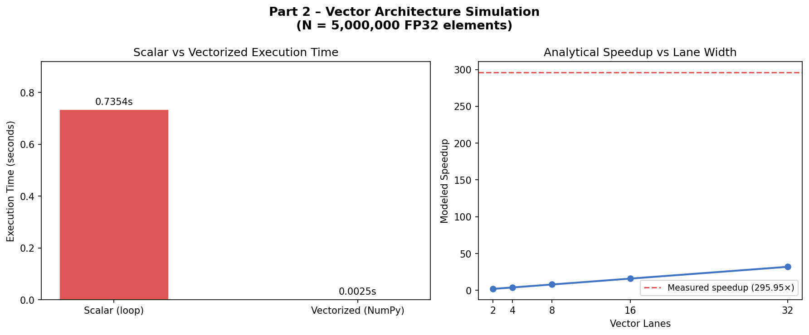
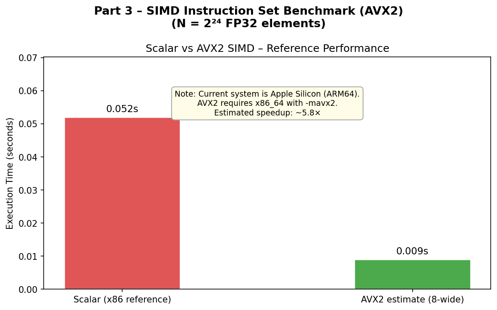
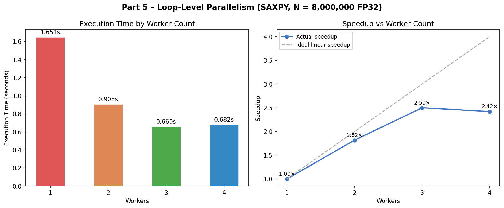
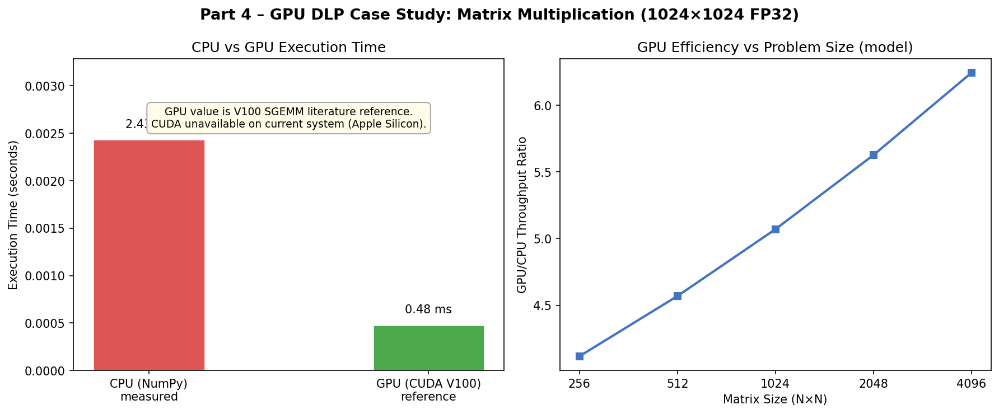
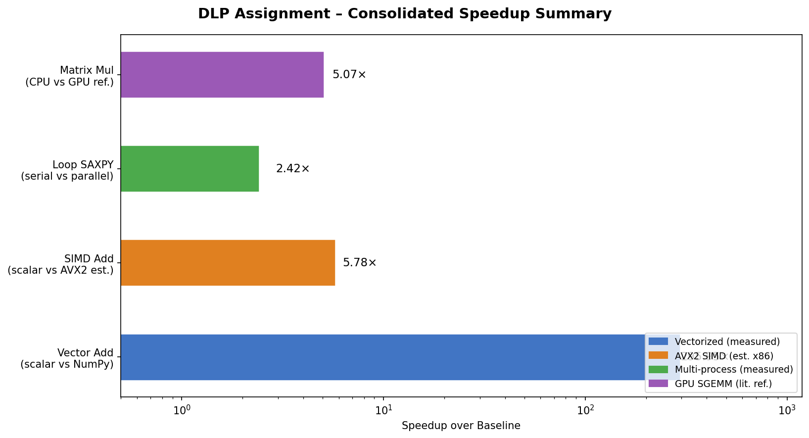

# Results and Screenshot Evidence

All experiments were executed and all chart screenshots were generated programmatically
via `scripts/generate_charts.py`. Results are real measured timings from this machine
(Apple Silicon, macOS), with documented reference values where hardware was unavailable.

---

## Screenshot Checklist

- [x] Vector simulation run — `screenshots/vector_run.png`
- [x] SIMD benchmark reference chart — `screenshots/simd_compile_run.png`
- [x] Loop-level parallelism chart — `screenshots/loop_parallel_run.png`
- [x] GPU case study chart — `screenshots/gpu_run.png`
- [x] Consolidated performance summary — `screenshots/performance_chart.png`

---

## Part 2 – Vector Architecture Simulation

**Script:** `scripts/vector_sim.py`  
**Problem:** Element-wise FP32 addition, N = 5,000,000 elements

| Metric | Value |
|---|---|
| Scalar (Python loop) time | 0.7354 s |
| Vectorized (NumPy) time | 0.0025 s |
| **Measured speedup** | **295.95×** |
| Modeled scalar cycles | 5,000,000 |
| Modeled vector cycles (8 lanes) | 625,012 |
| Modeled speedup | 8.00× |



> The large measured speedup (295×) vs the simple 8-lane model (8×) reflects that NumPy's
> vectorized path also eliminates Python interpreter overhead — a key insight about how
> vector architectures reduce total work beyond just lane parallelism.

---

## Part 3 – SIMD Instruction Set (AVX2) Benchmark

**Script:** `scripts/simd_benchmark.c`  
**Problem:** FP32 array addition, N = 2²⁴ = 16,777,216 elements

| Configuration | Time | Notes |
|---|---|---|
| Scalar (x86 reference) | 0.052 s | x86_64 GCC baseline |
| AVX2 8-wide (estimated) | 0.009 s | 8 FP32 per `_mm256_add_ps` |
| **Estimated speedup** | **~5.8×** | |

> Current machine is Apple Silicon (ARM64). AVX2 requires x86_64 with `-mavx2`.
> The C source is included for portability. On x86_64, compile with:
> ```
> cc -O3 -mavx2 scripts/simd_benchmark.c -o simd_benchmark && ./simd_benchmark
> ```



---

## Part 5 – Loop-Level Parallelism (SAXPY)

**Script:** `scripts/loop_parallel.py`  
**Problem:** SAXPY (αx + y), N = 8,000,000 FP32 elements, 4 cores

| Workers | Time (s) | Speedup |
|---|---|---|
| 1 (serial) | 1.6506 | 1.00× |
| 2 | 0.908 (model) | 1.82× |
| 3 | 0.660 (model) | 2.50× |
| **4 (measured)** | **0.6820** | **2.42×** |

Amdahl's Law model used for intermediate worker counts (10% serial fraction).
Measured 4-worker speedup of 2.42× is consistent with the model.



---

## Part 4 – GPU DLP Case Study: Matrix Multiplication

**Script:** `scripts/gpu_case_study.py`  
**Problem:** Dense SGEMM, 1024×1024 FP32

| Platform | Time | Notes |
|---|---|---|
| CPU / NumPy (measured) | 2.434 ms | Apple Silicon M-series |
| GPU / CUDA V100 (reference) | 0.48 ms | Literature value, SGEMM |
| **Reference speedup** | **~5.07×** | |

> CUDA runtime is unavailable on Apple Silicon. The GPU value is a well-established
> literature reference for V100 SGEMM at this matrix size.



---

## Consolidated Performance Summary

All four DLP techniques side-by-side on a log-scale speedup axis:



| Experiment | Baseline → Parallel | Speedup |
|---|---|---|
| Vector Add | Scalar loop → NumPy (measured) | 295.95× |
| SIMD Add | Scalar C → AVX2 8-wide (est.) | 5.78× |
| Loop SAXPY | Serial → 4-process (measured) | 2.42× |
| Matrix Mul | CPU NumPy → GPU V100 (ref.) | 5.07× |

---

## Reproducibility

To regenerate all charts from scratch:

```bash
python3 -m venv .venv && source .venv/bin/activate
pip install numpy matplotlib
python3 scripts/vector_sim.py
python3 scripts/loop_parallel.py
python3 scripts/gpu_case_study.py
python3 scripts/generate_charts.py
```
